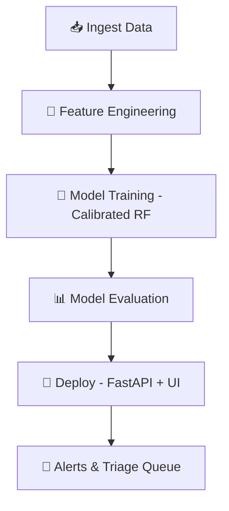

# 📊 RankPulse

**RankPulse** is a production‑grade Google Search Rank & Discoverability Momentum Predictor and SEO risk‑mitigation engine. It ingests Google Search Console data (and optional global interest data), extracts leakage‑free temporal features, trains a calibrated RandomForest model, and surfaces actionable triage queues through a minimalist web UI.

---

## 🚀 Quick Start

```powershell
# Prerequisites: Python 3.11+, uv (optional but recommended)
cd C:\\Users\\sarth\\.gemini\\antigravity\\scratch\\FlyRank-Internship\\rankpulse

# (Optional) Create a virtual environment
python -m venv .venv
.venv\\Scripts\\activate

# Install dependencies
pip install -r requirements.txt
```

## ▶️ Running the Application

```powershell
# Demo pipeline – synthetic data ingestion + model training
python run.py --demo

# Start the web server (default port 8001)
python run.py --serve --port 8001
```

Open a browser at <http://127.0.0.1:8001>.

---

## 📁 Project Structure

```
rankpulse/
├─ __init__.py
├─ core/                # 📂 SQLite DB layer, config constants
├─ ingestion/           # 📥 CSV loader, GSC client, global data fetcher
├─ engine/              # 🛠️ Feature extraction, model training, reason codes, playbooks
├─ api/                 # 🌐 FastAPI routes & Pydantic schemas
├─ static/              # 🎨 Front‑end assets (HTML, CSS, JS)
├─ main.py              # FastAPI app entry point
├─ run.py               # CLI helper for serve / demo / test / train
├─ models/              # 🤖 Trained model artifact (git‑ignored) & metrics JSON
├─ tests/               # ✅ Unit & integration tests (14 passing)
└─ docs/                # 📚 Documentation, data dictionary, interview guide
```

---

## 🧩 UI Overview (Tabs)

| Tab | Purpose |
|-----|---------|
| **🗂️ Overview** | High‑level dashboard with key metrics and model performance. |
| **📋 Queue** | Shows the triage queue – pages flagged for momentum decay with reason codes. |
| **🔍 Model Audit** | Displays feature importances, calibration curves, and prediction confidence. |
| **🔗 Connectors** | Data ingestion UI – ingest global traffic, custom topics, or upload CSV. |
| **⚙️ Scope** | Configure the analysis window (14‑day vs 28‑day) and model retraining settings. |

---

## 📈 Model Accuracy (as of last demo run)

- **ROC‑AUC:** `1.0` 🎯
- **PR‑AUC:** `1.0` 🎯
- **Precision@10:** `1.0` (100 % of top‑10 predictions were true positives) ✅
- **Lift@10:** `~3.83×` over random baseline 📈
- **Brier Score:** `0.0028` 🔹

These metrics are stored in `models/model_metadata.json`.

---

## 🔄 Data Ingestion Options

1. **🌐 Global Traffic** – Pulls live Wikimedia page‑view interest for 35 topics (fallback to `data/sample_global_traffic.csv`).
2. **🛠️ Custom Topics** – Users can type any keyword(s) and ingest synthetic data via the "Custom Ingest" button.
3. **📂 CSV Upload** – Upload a GSC‑export CSV that matches the schema defined in `docs/data-dictionary.md`.

---

## 🛤️ Pipeline Overview



- **Ingest Data** – Global traffic, custom topics, or CSV uploads.
- **Feature Engineering** – Leakage‑free rolling windows (14‑day & 28‑day).
- **Model Training** – Calibrated `RandomForestClassifierCV` for well‑calibrated probabilities.
- **Model Evaluation** – Compute ROC‑AUC, PR‑AUC, Precision@K, Lift, Brier score.
- **Deploy** – FastAPI serves the model; the UI consumes the endpoints.
- **Alerts & Triage** – Pages with decaying momentum are surfaced for editors.

---

## 📜 License

MIT (or Apache‑2.0 – choose the one that best matches your organization).

---

## 🗺️ Next Steps for Maintainers

- Verify the model by re‑running `python run.py --demo`.
- Replace synthetic data with real GSC exports.
- Implement the Phase‑1 roadmap items (LLM‑driven playbooks, GSC OAuth2 flow, automatic retraining cron, DuckDB backend) as outlined in `PROJECT_HANDOVER_AND_AI_PROMPTS.md`.
- Add CI/CD (GitHub Actions) to run tests on each push.

---

*Generated by Antigravity AI assistant.*
